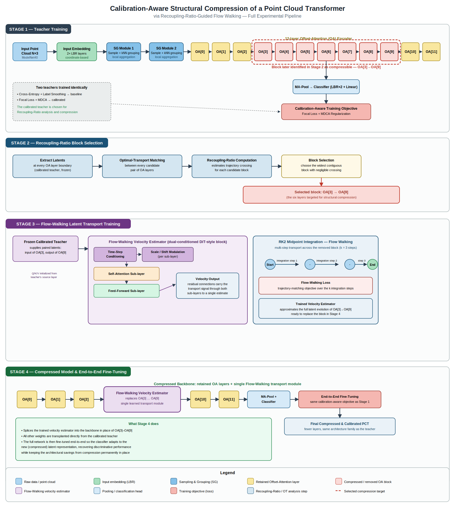

# Calibration-Aware Structural Compression of a Point Cloud Transformer via Recoupling-Ratio-Guided Flow Walking

This repository contains the experiment, code, and results for a study that combines **train-time model calibration** with **latent-flow-based structural compression** for transformer-based 3D point cloud classification. We train a calibrated Point Cloud Transformer (PCT) and then structurally compress it by replacing a block of its Offset-Attention layers with a single learned latent transport module, evaluating the effect on both classification accuracy and calibration quality.

---
 
**Acknowledgements**
 
This work was carried out under the guidance of Dr. Seema Kumari, R. Hebbalaguppe, and Prof. Shanmuganathan Raman.
 
---

## Overview

Modern deep classifiers are often **over-confident**: they achieve high accuracy while producing poorly calibrated confidence scores, which is problematic for safety-critical applications such as autonomous driving or robotics — both of which rely heavily on 3D point cloud understanding. Separately, transformer-based point cloud models such as **PCT** are computationally expensive due to their depth, motivating structural compression.

This project asks a question that, to our knowledge, had not been studied before:

> **Can a calibration-aware Point Cloud Transformer be structurally compressed — using a latent-flow transport mechanism — without losing the calibration benefits obtained during training?**

We answer this by building an end-to-end pipeline that:

1. Trains a 12-layer PCT with a calibration-aware objective (Focal Loss + MDCA).
2. Uses the **Recoupling Ratio** (an Optimal-Transport-based metric from the Latent Flow Transformer framework) to identify a contiguous block of Offset-Attention layers that can be safely compressed.
3. Trains a single **Flow-Walking** velocity estimator to replace that block.
4. Fine-tunes the compressed model end-to-end under the same calibration-aware objective.

This work builds on three prior papers:

| Paper | Contribution used in this work |
|---|---|
| **PCT: Point Cloud Transformer** (Guo et al., 2021) | Backbone architecture — neighbor embedding and the permutation-invariant **Offset-Attention** mechanism. |
| **A Stitch in Time Saves Nine: MDCA** (Hebbalaguppe et al., CVPR 2022) | The **MDCA** loss — a differentiable, train-time term that calibrates the full confidence vector, used alongside Focal Loss to train the teacher. |
| **Latent Flow Transformer (LFT)** (Wu et al., 2025) | The **Recoupling Ratio** diagnostic and the **Flow Walking** algorithm, adapted here from language-model layers to point-cloud Offset-Attention blocks. |

---

## Pipeline Diagram



The diagram above reproduces every stage of the experiment end to end: the full PCT encoder (input embedding, the two Sampling-and-Grouping modules, and the 12-layer Offset-Attention chain), the calibration-aware teacher training objective (Focal Loss + MDCA), the Optimal-Transport-based Recoupling-Ratio block-selection stage that identifies the OA[3]→OA[9] block, the internal architecture of the dual-conditioned DiT-style Flow-Walking velocity estimator together with its RK2 integration schedule, and the final compressed backbone with the trained transport module spliced in and fine-tuned end to end. Quantitative results are reported separately in the sections and tables below rather than on the diagram itself.

---

## Key Findings

- **Calibration and compressibility are complementary.** The FL+MDCA teacher consistently produced more favorable (lower) Recoupling Ratios across the middle Offset-Attention blocks than an uncalibrated baseline, suggesting calibration encourages latent representations that are easier to approximate with continuous transport.
- **Zero-shot compression alone is insufficient.** Immediately after layer replacement, accuracy drops substantially because the classifier hasn't adapted to the new latent distribution — the architectural savings are already locked in at this point, but predictive performance requires fine-tuning.
- **End-to-end fine-tuning recovers accuracy** to match (and slightly exceed) the teacher, while permanently retaining the parameter and FLOPs reduction from compression.
- **Calibration degrades modestly after fine-tuning but remains far better than the uncalibrated baseline**, indicating the class-wise confidence structure learned by the calibrated teacher is largely preserved through compression.

---

## Repository Structure

```
.
├── README.md                      # this file
├── pipeline_diagram_detailed.svg  # detailed block diagram of the full experiment
├── PCT_MDCA.py                    # Stage 1: PCT + Focal Loss + MDCA teacher training
├── RR_calculate.py                # Stage 2: Recoupling Ratio computation & block selection
├── LFT_FW.py                      # Stage 3: Flow-Walking velocity estimator training
├── Finetune.py                    # Stage 4: end-to-end fine-tuning of the compressed model
```

---

## Limitations & Future Work

- Evaluated only on **ModelNet40 classification**; extension to segmentation and large-scale scene understanding is future work.
- The relationship between calibration and latent compressibility is empirically observed, not theoretically explained.
- Only a single Flow-Walking transport operator was used to replace 6 layers; more expressive or hierarchical transport models may close the calibration gap after fine-tuning.
- Recoupling-Ratio-aware training (encouraging compressible latents *during* teacher training, rather than only analyzing them after the fact) is an open direction.

---

## References

1. R. Hebbalaguppe, J. Prakash, N. Madan, C. Arora. **A Stitch in Time Saves Nine: A Train-Time Regularizing Loss for Improved Neural Network Calibration.** CVPR 2022.
2. Y.-C. Wu, F.-T. Liao, M.-H. Chen, P.-C. Ho, F. Nabiei, D.-S. Shiu. **Latent Flow Transformer.** arXiv:2505.14513, 2025.
3. M.-H. Guo, J.-X. Cai, Z.-N. Liu, T.-J. Mu, R. R. Martin, S.-M. Hu. **PCT: Point Cloud Transformer.** arXiv:2012.09688, 2021.
